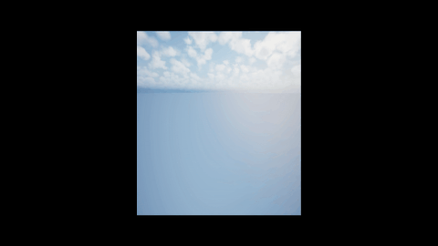
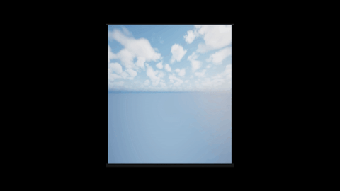
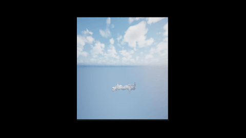
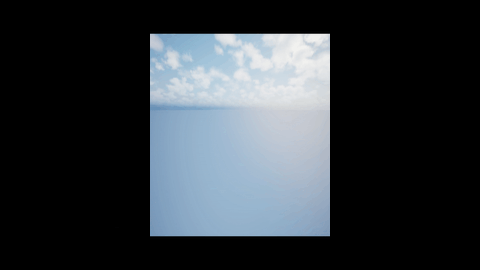

# MSc-Thesis-Arch-RAG-Expanding
utilizing voxel grids as a fundamental spatial syntax,Retrieval-Augmented Generation (RAG) system driven by a Transformer architecture. The model generates structures iteratively through two distinct stages: a "Bridge" phase,and a "Grow" phase.

  
  

  
  

Path File Download From Here []

