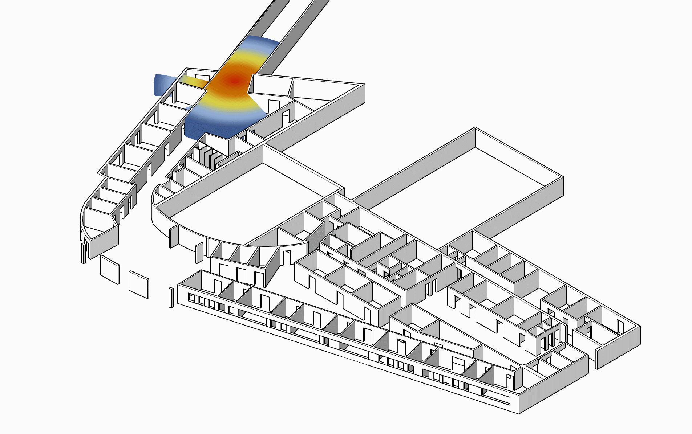

# MSc-Thesis-Arch-RAG-Expanding
utilizing voxel grids as a fundamental spatial syntax,Retrieval-Augmented Generation (RAG) system driven by a Transformer architecture. The model generates structures iteratively through two distinct stages: a "Bridge" phase,and a "Grow" phase.

  
  

  <b>Showcase 1</b>

  
  

  <b>Showcase 2</b>

## From Isovist to Space

  
   
  <em>Isovist Sample</em>

An isovist is an egocentric spatial descriptor that defines the volume of space visible or directly accessible from a single vantage point along line-of-sight rays. While fundamentally three-dimensional, isovists are frequently analyzed via two-dimensional planar or vertical cross-sections. Every point in physical space corresponds to a unique isovist polygon or polyhedron, making it a foundational representation for spatial analysis and visibility structure.

---

## Dataset Preparation Pipeline

To overcome the sensory noise, scanning limitations, and field constraints of real-world computer vision capture, this pipeline utilizes a simulated 3D environment to procedurally generate dense spatial datasets. Unreal Engine 5 serves as the virtual capture engine, simulating human-scale spatial exploration and transcribing sequential visual frames into structured 3D spatial representations.

### 1. Synthetic Environment Setup
- **Spatial Geometry:** Curated 3D architectural models representing diverse spatial typologies (enclosed, open, and corridor environments).
- **Engine Configuration:** Assets are imported and structured within Unreal Engine 5 with collision meshes and standardized lighting conditions.

### 2. Virtual Trajectory & Roaming
- **Camera Pathing:** Camera trajectories are defined to simulate continuous, first-person human locomotion at eye-level.
- **Data Synchronization:** Poses (position $[x, y, z]$ and orientation $[\text{pitch}, \text{yaw}, \text{roll}]$) are recorded frame-by-frame alongside timestamps.

### 3. Multi-Pass Frame Capture
- **RGB & Depth Extraction:** Using Unreal Engine's Scene Capture Component / Movie Render Queue, both high-resolution color frames and linear scene depth buffers are exported synchronously.
- **Camera Intrinsics:** Fixed field of view (FOV) and focal length parameters are logged to ensure accurate back-projection.

### 4. Spatial Discretization & Point Cloud Generation
- **Back-Projection:** 2.5D depth maps are unprojected into Euclidean 3D coordinates using camera intrinsic and extrinsic matrices.
- **Voxel / Grid Mapping:** The reconstructed point cloud is filtered, registered, and discretized into a uniform grid matrix (e.g., occupancy grids / voxelized isovist fields) for downstream generative modeling.

Path File Download From Here []

